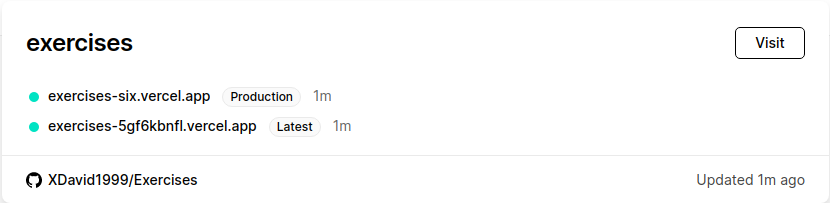
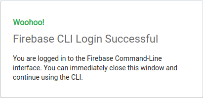

# Configurando Vercel y Firebase para poder trabajar con ellos localmente

Las computación serverless es un modelo de ejecución de la computación en la propia nube en el que el proveedor de la misma tiene en funcionamiento un servidor que provee de los recursos necesarios a los usuarios de esta dinámicamente. Ello beneficia al cliente en distintos aspectos como: prescindir de las máquinas necesarias para el despliegue, la inversión en actualizaciones hardware de las mismas, posibilidad de acceso desde cualquier dispositivo, etc. Para el proveedor de estos servicios también es más sencillo el cobro de los costos por utilización ya que con este modelo el uso de los recursos por parte del usuario es más cuantificable.

## Vercel

Configurar Vercel para uno de nuestros proyectos es, como veremos, extremadamente sencillo. Para ello solamente tendremos que seguir los siguientes pasos:

- Nos dirigiremos a la página de este software y nos daremos de alta enlazando el mismo con nuestra cuenta GitHub. En un primer paso autorizaremos a vercel a obtener algunos permisos: verificar uestra identidad, saber que a que recursos puede acceder...
- A continuación se nos preguntará si esta es nuestra cuenta personal o no, en caso afirmativo se instalará Vercel para GitHub, procederemos clicando en "Yes".
- Acto seguido elegiremos cual de nuestros proyectos(repos) deseamos importar. Seleccionaremos el deseado eligiendo importarlo desde el directorio raíz.
- Más tarde, localmente, instalaremos el SDK  de vercel con **npm i -g vercel** y lo podremos en funcionamiento ejecutando el comando **vercel**.
- Nos pedirá entonces que nos logeemos con nuestro e-mail, se nos enviará un correo de confirmación y, confirmado el correo, ejecutaremos nuevamente **vercel**. 
- Una vez realizado el paso anterior el programa nos informa de que para desplegar para producción simplemente deberemos ejecutar **vercel --prod**.
- Finalizado el proceso podremos ver en la página de inicio como nuestro proyecto funciona correctamente.

## Firebase

En este caso procederemos a darnos de alta en Firebase y descargarnos sus SDKs. A continuación detallamos los pasos que debemos seguir para ello:

- Firebase es una plataforma de desarrollo de aplicaciones creada por el propio Google por lo que no será necesario crear una cuenta para poder utilizarlo.
- Crearemos entonces un nuevo proyecto en la plataforma e instalaremos Firebase CLI. Podemos ver en la propia [página](https://firebase.google.com/docs/cli?authuser=0#mac-linux-npm) del sotware como hacerlo con npm o con cURL. En nuestro caso ejecutaremos **curl -sL https://firebase.tools | bash**.
- Para acceder al mismo  ejecutamos **firebase login** conectando así nuestro PC y Firebase, pudiendo acceder a los proyectos en la plataforma desde nuestra máquina.

- Hecho el paso anterior comprobaremos que todo funciona correctamente listandi los proyectos que tenemos en firebase.

