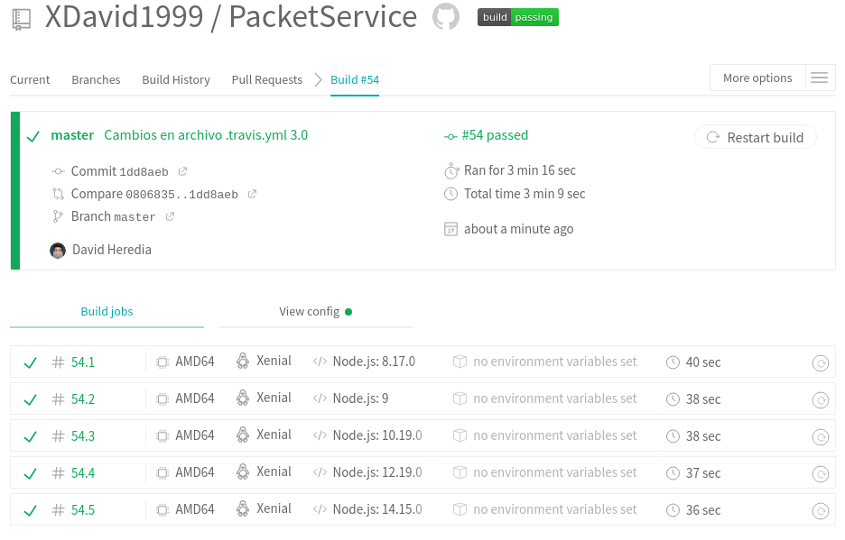

# Configurando integración continua para nuestra app

- Necesitaremos crear dentro de nuestro [proyecto](https://github.com/XDavid1999/PacketService) un archivo [.travis.yml](https://github.com/XDavid1999/PacketService/blob/master/.travis.yml) que proporcione a travis información acerca de aspectos relevantes de nuestro proyecto. Lo que travis hará, por defecto, será pasar los [test](https://github.com/XDavid1999/PacketService/blob/master/test/packetServiceTest.js) que tengamos hechos.
- En este archivo especificaremos nuestro lenguaje, en nuestro caso *node_js*,con el tag **language**.
- Probaremos distintas versiones de nuestro lenguaje, en este caso: *8.17.0, 9, 10.19.0, 12.19.0 y 14.15.0*. Para ello solo deberemos poner el tag **node_js** y debajo las versiones a testear.
- Los paquetes a instalar, en nuestro caso nuestro taskrunner, con **install**.
- La orden que ejecutará travis, que será instalar las dependencias y correr los test con nuestro *taskrunner*, con **script**.

En este caso, al usar docker, no sería necesario especificar ni el lenguaje que utilizaremos ni la versión del mismo ya que los test correrán dentro de nuestro contenedor, que ya tiene todo lo necesario.

## Script

~~~
language: node_js
node_js:
  - 8.17.0
  - 9
  - 10.19.0 # Versión en mi PC
  - 12.19.0 # La de mi contenedor
  - 14.15.0

install:
  - npm install -g gulp

  script:
  - gulp install
  - gulp test
~~~

## Último build correcto
