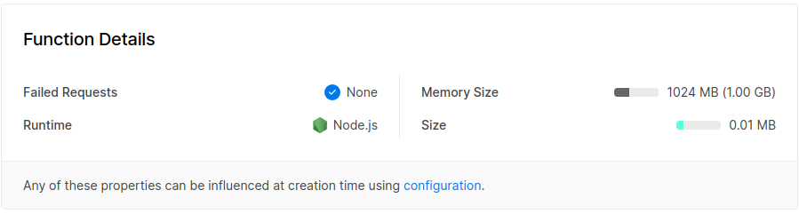

# Tomar una función de prueba en Vercel y hacer un despliegue de prueba

En este caso procederemos a tratar de tomar una de las funciones que se nos proporcionan en la propia [página](https://vercel.com/docs/serverless-functions/supported-languages#node.js) y realizar un pequeño despliegue de la misma. Para ello usaremos node, que es el lenguaje que utilizamos en nuestro proyecto. Seguiremos para conseguirlo la siguiente secuencia de pasos:

- Crearemos una carpeta llamada **api** y dentro de la misma un archivo que denominaremos **[hello.js](../../api/hello.js)**. 
- Dentro del archivo anteriormente mencionado escribiremos el siguiente código:

~~~
module.exports = (req, res) => {
  const { name = 'World' } = req.query
  res.status(200).send(`Hello ${name}!`)
}
~~~

- Con este conseguiremos que se reciba en la URL como parámetro un nombre y que se devuelva un saludo a este.
- Podemos ver después de haber actualizado los cambios en nuestro repositorio que funciona correctamente.

- Puede probarse este sencillo ejemplo en [este enlace](https://exercises.xdavid1999.vercel.app/api/hello.js?name=David).